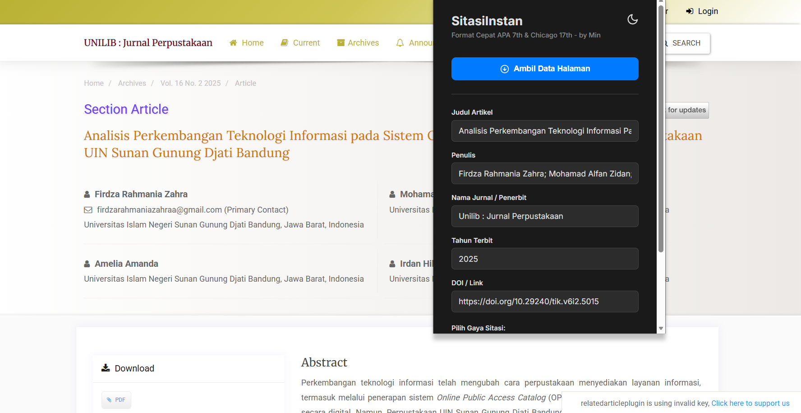

# 🎓 SitasiInstan

**SitasiInstan** adalah solusi cerdas untuk manajemen sitasi yang dirancang khusus untuk menjawab keresahan mahasiswa dalam menyusun karya ilmiah. Proyek ini lahir dari pengamatan bahwa banyak mahasiswa masih merasa kesulitan, bingung, atau terbebani (baca: malas) saat harus menggunakan tools kompleks seperti Mendeley atau Zotero.

## 🚀 Latar Belakang
Banyak mahasiswa menghabiskan waktu berjam-jam hanya untuk urusan format sitasi dan daftar pustaka. Meskipun alat seperti Mendeley dan Zotero sudah ada, kurva pembelajaran yang curam seringkali menjadi penghambat. **SitasiInstan** hadir untuk menyederhanakan proses tersebut dengan antarmuka yang lebih intuitif dan alur kerja yang lebih ringan.

## ✨ Fitur Utama

- **⚡ Instant Citation Generator**: Buat sitasi dalam hitungan detik tanpa perlu konfigurasi plugin yang rumit.
- **📚 Duo-Style Support**: Mendukung format sitasi populer (APA dan Chicago.)

## 🛠️ Teknologi yang Digunakan
*Daftar teknologi yang digunakan dalam pengembangan proyek ini:*
- Javascript
- CSS
- HTML

## 📝 Cara Penggunaan
1. Clone repositori ini.
2. Install di Peramban Desktop melalui load unpacked di bagian extensions, jangan lupa nyalakan mode developer.
3. Jalankan aplikasi.

## 🖼️ Preview
Berikut adalah tampilan dari ekstensi **SitasiInstan**:

---
